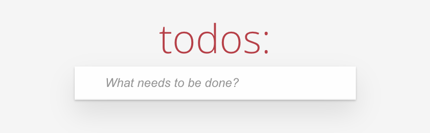
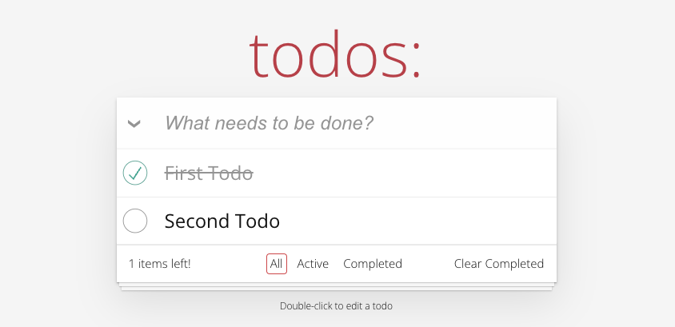

# Todo App (React + TypeScript + Redux)

[LIVE DEMO LINK](https://ts-todos-app.netlify.app/)

This is minimalist and appealing todo web application that can help track tasks that needs to be done (aka **todos**).

Users have the ability to add, edit and remove their todos. Mark them as done. Filter them to see all, active or completed todos. And also remove all completed todos in one click.





## Stack


## Features

- **Add new todos** - using text input and pressing `Enter/Return` key to add it to the list.
- **Edit todo name** - by double-clicking on todo item.
- **Remove item** by hovering over todo item and clicking on the remove button 'X'.
- **Mark all todos as completed** by using a button on the left side of text input.
- **Filter todos** to see: all, active or completed by using filters menu at the bottom.
- **Remove completed todos** by using a 'Clear Completed' button at the bottom.

## How to run locally

- install dependencies

```js
npm install
```

- start local server via Vite

```js
npm run dev
```

⚡ Have a productive day ⚡
